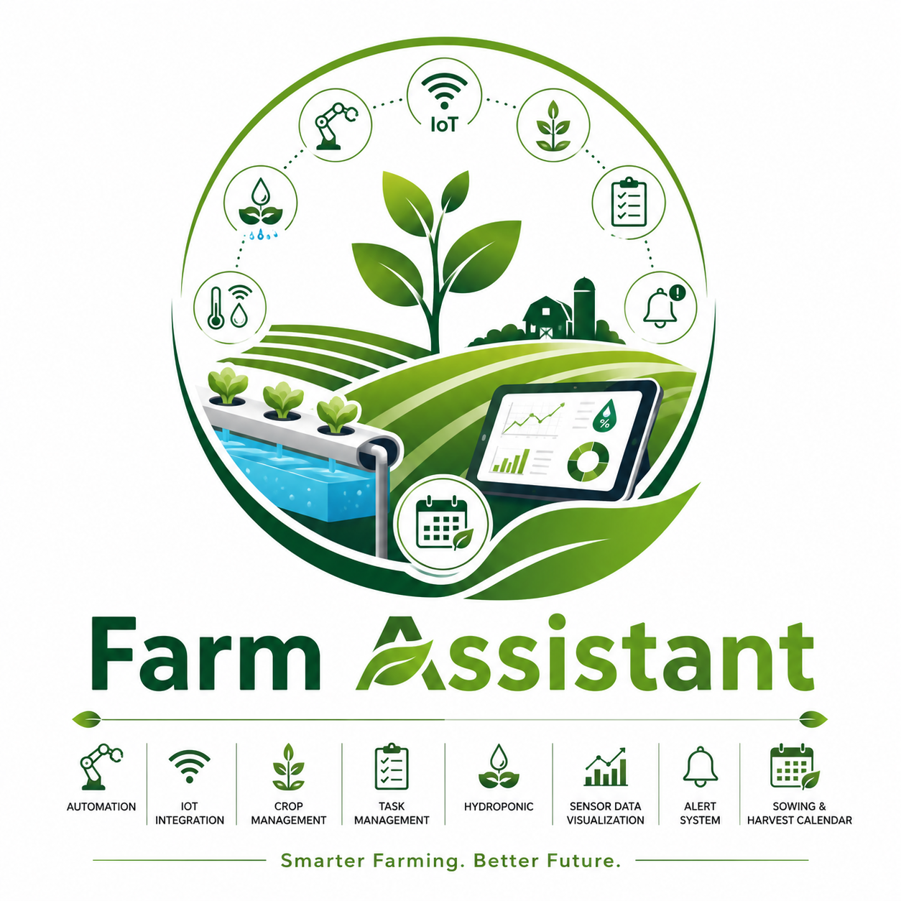

# Farm Assistant



A comprehensive farm and garden management application built with Laravel, Inertia, and React. Features garden management, crop tracking, hydroponics management, ESPHome integration, sensor data visualization, alerts, and a sowing/harvesting calendar.

## Features

- **Garden Management** — Organize farms into zones (greenhouse, outdoor, hydroponic, nursery)
- **Crop Tracking** — Database of crops with optimal pH, TDS, and temperature ranges
- **Crop Cycles** — Track planting, growing, and harvesting cycles per zone
- **Hydroponics Management** — Manage hydroponic systems and log nutrient solutions
- **ESPHome Integration** — Connect ESPHome sensors and devices to collect real-time data
- **Sensor Data Visualization** — Live readings, historical charts, min/max/average stats
- **Alert System** — Configurable thresholds on any sensor entity with severity levels
- **Task Management** — Farm tasks with priority and status tracking
- **Sowing & Harvesting Calendar** — Month-view calendar with crop cycle overlays
- **Notification System** — In-app notifications for alerts and system events

## Requirements

- PHP 8.3+
- Node.js 20+
- Composer 2+
- SQLite (default), MySQL, PostgreSQL, or SQL Server

## Quick Start

```bash
# Clone and install
git clone <repo-url> farm-assistant
cd farm-assistant
composer install
npm install

# Environment
cp .env.example .env
php artisan key:generate

# Database (SQLite default)
touch database/database.sqlite
php artisan migrate --seed

# Build frontend
npm run build

# Start dev servers
php artisan serve
npm run dev
```

Visit `http://localhost:8000` and log in with `farm@example.com` / `password`.

## ESPHome Integration

Farm Assistant uses an entity-based architecture (inspired by Home Assistant) designed to work seamlessly with ESPHome devices. Devices report sensor data via entities, which store time-series readings in `entity_states`.

### Architecture

```
ESPHome Device ──► MQTT Broker ──► Webhook ──► Farm Assistant
                ──► Native API ──► Polling Command
                ──► HTTP POST  ──► API Endpoint
```

### 1. Connect via Webhook (Recommended)

Configure your ESPHome device to POST sensor data to Farm Assistant.

**ESPHome YAML:**
```yaml
esp32:
  board: esp32dev

wifi:
  ssid: "YourWiFi"
  password: "YourPassword"

# Sensors
sensor:
  - platform: dht
    pin: GPIO22
    temperature:
      name: "Greenhouse Temperature"
      id: greenhouse_temp
    humidity:
      name: "Greenhouse Humidity"
    update_interval: 60s

# HTTP Client to POST data to Farm Assistant
http_request:
  headers:
    Content-Type: application/json
  on_response:
    then:
      - logger.log: "Data sent to Farm Assistant"

interval:
  - interval: 60s
    then:
      - http_request.post:
          url: !secret farm_assistant_url  # e.g. http://192.168.1.100:8000/api/esphome/webhook
          json:
            device: "greenhouse-node-1"
            entities:
              - entity_id: "sensor.greenhouse_temperature"
                value: !lambda |-
                  return id(greenhouse_temp).state;
                unit: "°C"
                device_class: "temperature"
                entity_type: "sensor"
              - entity_id: "sensor.greenhouse_humidity"
                value: !lambda |-
                  return id(humidity).state;
                unit: "%"
                device_class: "humidity"
                entity_type: "sensor"
```

Run `touch /config/secrets.yaml` and add:
```yaml
farm_assistant_url: "http://YOUR_SERVER_IP:8000/api/esphome/webhook"
```

### 2. Connect via MQTT

Configure an MQTT bridge that forwards ESPHome MQTT messages to Farm Assistant.

**ESPHome MQTT config:**
```yaml
mqtt:
  broker: 192.168.1.50
  topic_prefix: esphome/greenhouse-node-1

sensor:
  - platform: dht
    pin: GPIO22
    temperature:
      name: "Greenhouse Temperature"
    humidity:
      name: "Greenhouse Humidity"
```

Then configure your MQTT bridge (e.g., Node-RED, Mosquitto plugin) to forward messages from `esphome/+/+/state` to:

```
POST http://YOUR_SERVER:8000/api/mqtt/webhook
Content-Type: application/json

{
  "topic": "esphome/greenhouse-node-1/sensor.greenhouse_temperature/state",
  "payload": {
    "state": "23.5",
    "unit_of_measurement": "°C",
    "device_class": "temperature"
  }
}
```

### 3. Connect via Polling

If your ESPHome devices expose the native HTTP API, use the polling command:

```bash
# Poll all active devices
php artisan esphome:poll

# Poll a specific device by ID
php artisan esphome:poll --device=1

# Schedule in crontab (every 5 minutes)
*/5 * * * * cd /path/to/farm-assistant && php artisan esphome:poll >> storage/logs/esphome-poll.log 2>&1
```

**Note:** The ESPHome native API must be enabled on the device (see `api:` in ESPHome YAML) and the HTTP API is available on port 6053.

### 4. Manual API Call

```bash
curl -X POST http://localhost:8000/api/esphome/webhook \
  -H "Content-Type: application/json" \
  -d '{
    "device": "test-sensor",
    "entities": [
      {
        "entity_id": "sensor.temperature",
        "value": "23.5",
        "unit": "°C",
        "device_class": "temperature",
        "entity_type": "sensor"
      }
    ]
  }'
```

For an existing device:
```bash
curl -X POST http://localhost:8000/api/esphome/device/1/state \
  -H "Content-Type: application/json" \
  -d '{
    "status": "online",
    "entities": [
      {
        "entity_id": "sensor.humidity",
        "value": "68",
        "unit": "%",
        "device_class": "humidity"
      }
    ]
  }'
```

### Adding Devices via UI

1. Navigate to **Devices** in the sidebar
2. Click **Discover ESPHome** to scan your network, or **Manual Add** to enter details by hand
3. For discovered devices, click **Configure** to review and add the device
4. Devices and entities are auto-created when data arrives via webhook/MQTT if they don't already exist

**Important:** Your ESPHome device **must** have the `api:` component enabled for discovery and probing to work. Farm Assistant connects to the ESPHome Native API on port 6053 to read device info, config, and entity states. Additionally, the `web_server:` component must be enabled (on port 80) for entity discovery via the SSE `/events` endpoint.

```yaml
# Minimum ESPHome config for Farm Assistant discovery
esphome:
  name: my-device
  friendly_name: My Device

api:        # <-- Required for discovery/probing (port 6053)
web_server: # <-- Required for entity discovery via SSE (port 80)

wifi:
  ssid: !secret wifi_ssid
  password: !secret wifi_password
```

Without `api:` and `web_server:`, the device will not respond and cannot be discovered or probed.

**Note:** The `esphome_node` identifier is automatically normalized to lowercase (e.g., `MyDevice` becomes `mydevice`). This ensures consistent matching regardless of how the device was first registered (via webhook, discovery, or manual entry).

### Alert Rules

Configure threshold alerts on any sensor entity:

1. Go to **Alerts → Manage Rules**
2. Click **New Rule**
3. Select an entity (e.g., `sensor.greenhouse_temperature`)
4. Set condition (e.g., `>`), threshold (e.g., `35`), and severity
5. When the sensor value crosses the threshold, an alert is triggered automatically

Alerts are evaluated by the `ProcessEntityState` queue job whenever new state data arrives. Ensure the queue worker is running:

```bash
php artisan queue:work
```

## API Endpoints

| Method | Path | Description |
|--------|------|-------------|
| POST | `/api/esphome/webhook` | Ingest sensor data (auto-creates device + entities) |
| POST | `/api/esphome/device/{id}/state` | Update state for an existing device |
| POST | `/api/mqtt/webhook` | MQTT bridge webhook |
| GET | `/sensor-data/{entity}/history?range=24h` | Historical JSON data (1h, 6h, 24h, 7d, 30d) |

## Entity Types

The system supports all standard Home Assistant entity types:

`sensor`, `binary_sensor`, `switch`, `number`, `button`, `select`, `light`, `fan`, `valve`, `pump`, `automation`

## Database

```bash
# Run migrations
php artisan migrate

# Seed demo data
php artisan db:seed

# Fresh start
php artisan migrate:fresh --seed
```

The database schema includes 17 tables optimized for time-series sensor data:

- `devices` — ESPHome nodes with MQTT topic, IP, firmware version, status
- `entities` — Individual sensors/actuators per device
- `entity_states` — Time-series readings with JSON attributes (indexed on `entity_id, recorded_at`)
- `crops` — Crop database with optimal growing parameters
- `crop_cycles` — Planting/harvest cycles linked to zones and crops
- `hydroponic_systems` / `nutrient_solutions` — Hydroponic management
- `alert_rules` / `alerts` — Configurable threshold alerts
- `automation_rules` — JSON-based automation conditions and actions
- `ai_observations` — AI-generated recommendations

## Queue

The alert system and state processing use Laravel's queue:

```bash
# Process queued state data
php artisan queue:work

# Default queue driver is database (configured in .env)
```

## Testing

```bash
php artisan test
```

## Commands

```bash
php artisan esphome:poll              # Poll ESPHome devices
php artisan esphome:poll --device=1   # Poll a specific device
php artisan queue:work                # Process state data and evaluate alerts
```

## Tech Stack

- **Backend:** Laravel 13, PHP 8.3+
- **Frontend:** React 19, Inertia.js 3, TypeScript, Tailwind CSS 4
- **Database:** SQLite (dev) / MySQL / PostgreSQL
- **Auth:** Laravel Fortify (passkeys, 2FA, teams)
- **Queue:** Database driver (default)
